<h1 align="center">Note Collection</h1>

<p align="center">
<font size="20px">Not Koleksiyonu</font><br />
</p>
 
<p align="center">
  
    <br /><br />
</p>

language: [English](README_en.md) | [简体中文](README_zh-cn.md) | [繁體中文](README_zh-tw.md) | [Français](README_fr.md) | [Deutsch](README_de.md) | [Español](README_es.md) | [日本語](README_ja.md) | [한국어](README_ko.md) | [Русский](README_ru.md) | [Italiano](README_it.md) | [Português (Brasil)](README_pt-br.md) | [Türkçe](README_tr.md) | [Polski](README_pl.md) | [Čeština](README_cs.md)

Etiketlenmiş not dosyalarını yönetmek ve toplamak için bir VS Code uzantısı. Temiz ve sezgisel bir arayüz ile notlarınızı verimli bir şekilde düzenleyin.

## Özellikler

- **Notları etiketle organize etme** : Notları özel etiketlerde kategorilendirme, çok seviyeli dizin etiketlerini desteklenir
- **Tam metin arama** : Tüm not dosyalarında içeriği anında arama
- **Etiket yönetimi** : Etiketleri kolayca oluşturma, yeniden adlandırma ve silme
- **İçe aktar/Dışa aktar** : Verileri geri yüklemek için JSON yedekleme dosyalarını içe aktar, koleksiyonu TXT veya JSON yedekleme dosyaları olarak dışa aktar
- **Sürükle ve bırak** : Not dosyalarını/klasörlerini hızlı kategorizasyon için farklı etiketlere sürükle
- **Dosya entegrasyonu** : Notları yeni pencerelerde aç veya dosya gezgininde göster
- **Notları etkinleştir/devre dışı bırak** : Notları silmeden görünürlüğünü değiştir
- **Çok dilli destek** : 12 dili destekler
  - English, 简体中文, 繁體中文, Français, Deutsch, Español
  - 日本語, 한국어, Русский, Italiano, Português (Brasil), Türkçe, Polski, Čeština

## Video rehberi

- [youtube](https://www.youtube.com/watch?v=uH8zRXyZyVA)
- [](https://www.youtube.com/watch?v=uH8zRXyZyVA)

- [bilibili](https://www.bilibili.com/video/BV1TkPMzhEF2/)
- [](https://www.bilibili.com/video/BV1TkPMzhEF2/)

## Kurulum

### VS Code Marketplac'dan yükle

1. VS Code'u aç
2. Uzantılar paneline git (Ctrl+Shift+X)
3. "Not Collection" ya da "Notlar Koleksiyonu" ara [uzantı markette](https://marketplace.visualstudio.com/items?itemName=SaraKale.note-collection)
4. Yükle'yi tıkla

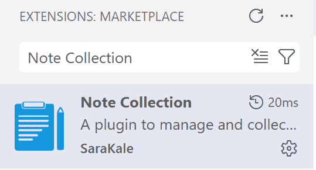

### VSIX dosyasından yükle

1. [Releases](https://github.com/sarakale/vscode-note-collection/releases) sayfasından en son `.vsix` dosyasını indir
2. VS Code'u aç
3. Ctrl+Shift+P'ye basarak Komut Paletini aç
4. "Extensions: Install from VSIX..." seç
5. İndirilen `.vsix` dosyasını seç

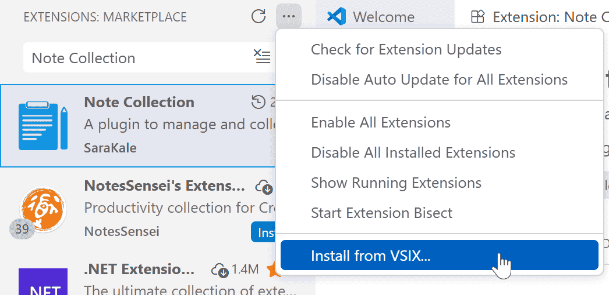

## Kullanım

### Başlarken

1. Yükleme sonrası, "Note Collection" görünümü sol aktivite çubuğunda görünecek
2. Yan paneli açmak için simgeye tıkla
3. Notlarınızı eklemeye başlayın!
4. Dili değiştirmek için VS Code'u yeniden başlatmanız gerekir.

### Temel İşlemler

#### Etiketlere not ekleme

- Bir etikete sağ tıklayın, not dosyalarını/klasörlerini eklemek için "Dosyalar/Klasörleri İçe aktar..." seç

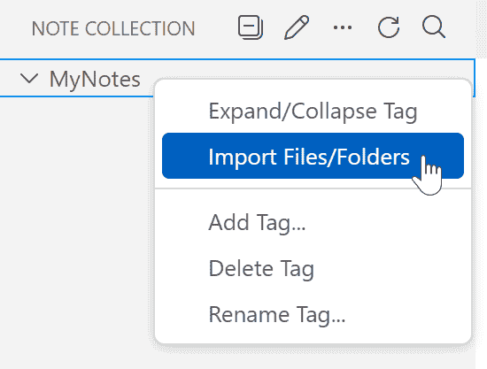

- Dosya gezgininden dosyaları/klasörleri etiketlere sürükle ve bırak

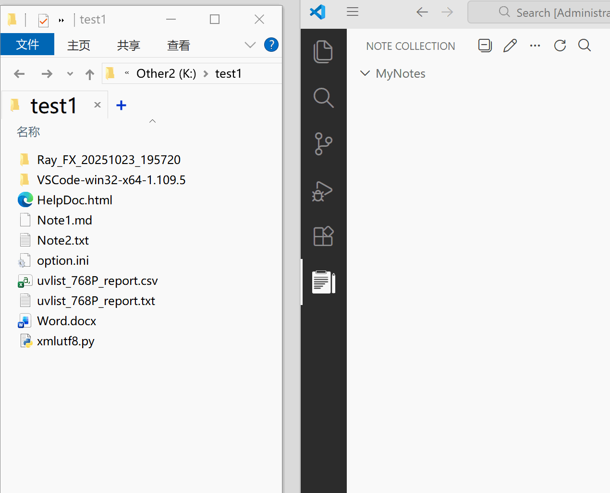

- Bir dosya taşınmış veya silinmişse, bir uyarı simgesi ve mesaj görünecektir.


- Daha fazla işlemlerde manuel olarak yollar da girebilirsiniz, bu daha fazla yol girmek için özel bir Webview paneli açar.
    - Etiket girişi, İngilizce virgülle ayrılmış birden fazla etiket girebilirsiniz:
        ```
        Note1,Note2
        ```
    - Dosya tam yolu girişi, satır başına bir dosya yolu:
        ```
        D:\yol\dosya1.txt
        D:\yol\dosya2.txt
        ```
		
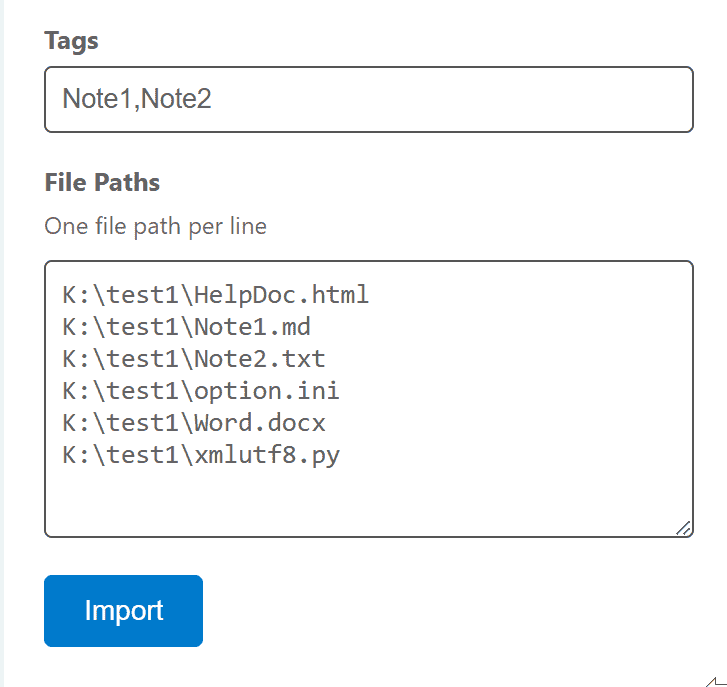

- Dosya gezgininde yeni dosyalar/klasörler eklenirse, arayüz otomatik olarak yenilenir. Yeni dosyalar veya klasörler görünmezse, manuel olarak yenile düğmesine tıklayabilirsiniz.
- Dosyaları/klasörleri taşıdığınızda veya sildiğinizde, arayüz hızlı bir şekilde yenilenmez. Güncellemek için manuel olarak yenile düğmesine tıklamanız gerekir.

#### Etiketleri yönetme

- "Daha fazla" menüsünde "Etiket Ekle..." tıklayarak yeni etiketler/çok seviyeli etiketler oluştur
- Etiketleri sağ tıklayarak etiket ekle, etiketleri yeniden adlandır, etiketleri sil
- Bir etiketi silmek, içindeki not dosyalarını silmez, sadece onları koleksiyondan kaldırır
- Tüm etiket içeriğini genişletmek/daraltmak için daraltma simgesine tıkla
- Etiketleri diğer etiketlerin içine de taşıyabilirsiniz

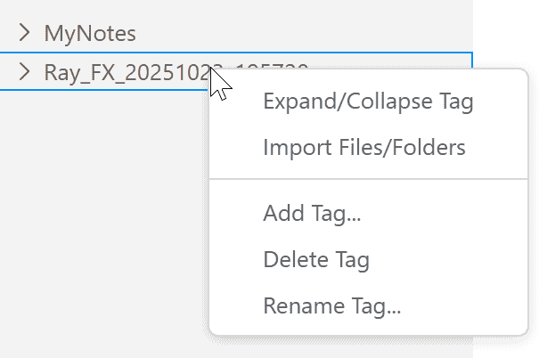

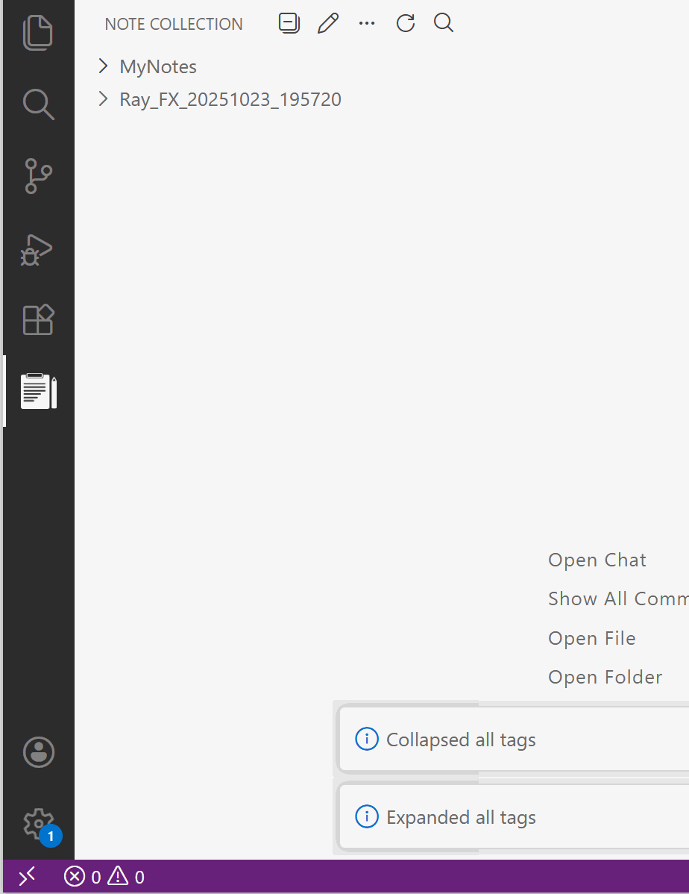

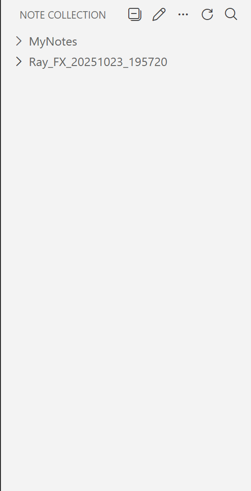

#### Notları ara

- Araç çubuğundaki arama simgesine tıkla
- Tüm etiketlerde not bulmak için arama anahtar kelimelerini gir
- 50 eşleşen sonuca kadar gösterir
- Yalnızca yaygın metin formatlarını destekler; resimler/belgeler/videolar yalnızca dosya adlarını arar. İkili dosyalar için üçüncü taraf tam metin arama yazılımı gerekir, örneğin: Recoll, DocFetcher, vb.

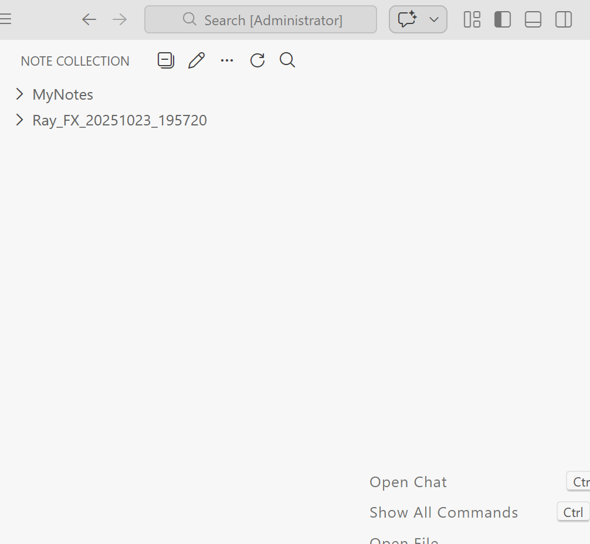

#### Not İşlemleri

- **Aç** : Çift tıkla veya bağlam menüsünden "Dosyayı Aç" seç
- **Gezginde Göster** : Dosyanın konumunu gezgini aç
- **Notu Yeniden Adlandır** : Yeni bir isme değiştirilebilir
- **Etiketleri Düzenle** : Notlara birden fazla etiket ekle
- **Notu Sil** : Koleksiyondan notları kaldır
- **Etkinleştir/Devre Dışı Bırak** : Not dosyası öğelerini gizle/göster, dosyayı gerçekten silmez.

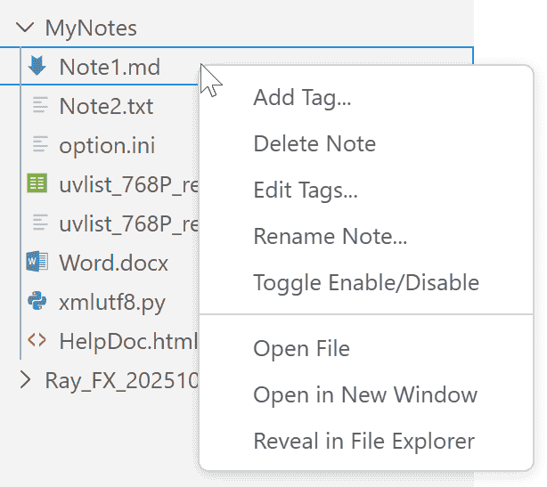

### TXT Dışa Aktar / JSON Yedekleme Dosyalarını İçe Aktar Dışa Aktar

- Daha fazla işlemlerde:
- **TXT Olarak Dışa Aktar** : Tüm not koleksiyonu listesini metin dosyası olarak dışa aktar
- **JSON Yedekleme Dosyasını Dışa Aktar** : Not koleksiyon durumunuzu kaydetmek için bir JSON yedekleme dosyası oluşturun, kolay geri yükleme veya başka cihazlara taşımak için.
- **JSON Yedekleme Dosyasını İçe Aktar** : Önceden dışa aktarılan bir JSON yedekleme dosyasından not koleksiyonu durumunu geri yükle.
  - Not: Bir JSON yedekleme dosyası içe aktarmak mevcut not koleksiyonu durumunu geçersiz kılacak, dikkatli ilerleyin.


## Ekran Görüntüleri

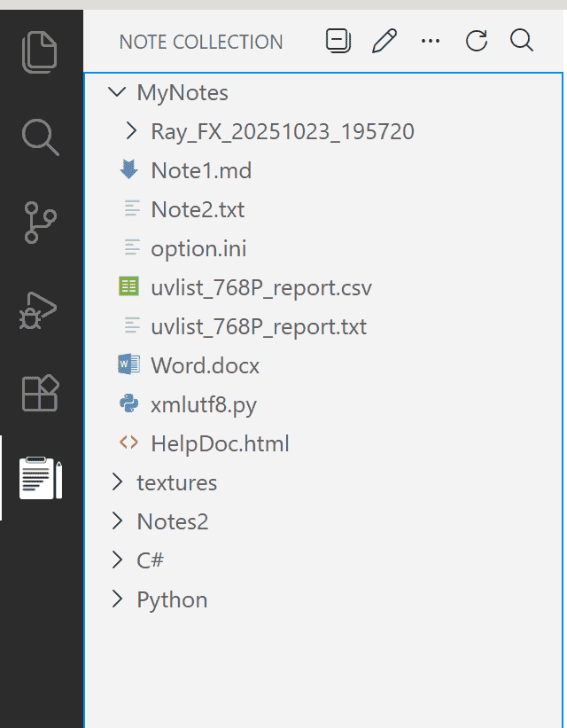

## Sistem Gereksinimleri

- Visual Studio Code sürüm 1.80.0 veya üzeri

## Bilinen Sorunlar

1. İlk yükleme sonrası, dili değiştirmek için VS Code'u yeniden başlatmanız gerekebilir.
2. Etiketleri daraltırken/genişletirken, arayüz yenileme sorunları ortaya çıkabilir. Çözmek için etiketleri manuel olarak genişletmeyi deneyin.
3. Çok fazla not öğesi varsa, VS Code'un yüklenmesi uzun sürebilir. 6000'den fazla notla test ettim ve açılması 8 saniye sürdü. Notlar görünmezse, yüklenmesini sabırla bekleyin.

## Katkıda Bulunma

Katkılar hoş karşılanır! Lütfen Pull Request gönderin.

1. Bu depoyu fork et
2. Bir branch oluştur ve commit et
5. Bir Pull Request aç

## Derleme Talimatları

### Yerel Geliştirme

1. Depoyu klonla
```bash
git clone https://github.com/sarakale/vscode-note-collection.git
cd vscode-note-collection
```

2. Bağımlılıkları yükle
```bash
npm install
```

3. TypeScript derle
```bash
npm run compile
```

4. Hata ayıklamayı başlatmak için VS Code'da F5'e bas

### Uzantı Paketle

1. vsce yükle (VS Code Extension Packager)
```bash
npm install -g vsce
```

2. `.vsix` dosyası olarak paketle
```bash
npm run package
```

Veya doğrudan vsce komutunu kullan
```bash
vsce package
```

3. Oluşturulan `.vsix` dosyası manuel olarak yüklenebilir.

## Değişiklik Günlüğü

Her sürümün güncelleme detayları için [CHANGELOG.md](CHANGELOG.md) bakın.

## Lisans

Bu proje GPL-3.0 Lisansı altında lisanslanmıştır - detaylar için [LICENSE](LICENSE) dosyasına bakın.

## Destek

Herhangi bir sorunla karşılaşırsanız veya özellik önerileriniz varsa, lütfen ziyaret edin:
- [GitHub Issues](https://github.com/sarakale/vscode-note-collection/issues)

## Teşekkürler

- Bu uzantıyı kullanan ve destekleyen tüm kullanıcılara teşekkürler
- [vscode-project-manager](https://github.com/alefragnani/vscode-project-manager) esinlenilmiş, bu temelde daha fazla işlev eklenmiş.

---
